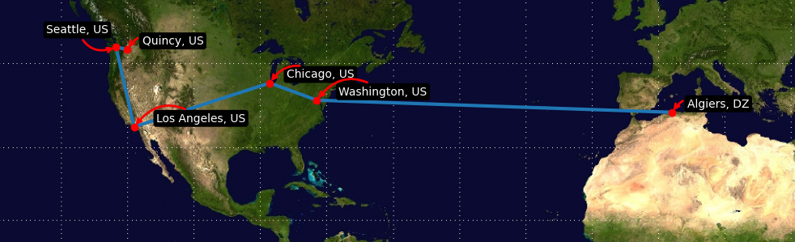

# Traceroute_On_World_Map
Draw Traceroute results in a world map. 

First, install the dependencies: **pip install adjustText requests matplotlib**

and change line **106**: `points = get_routes("yahoo.com")` and change the host/IP to draw it on the map.

#### Example result of yahoo.com:

